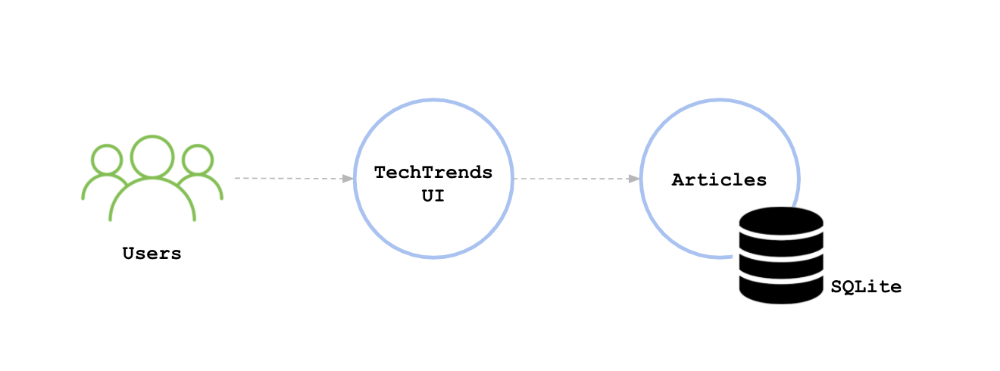

# TechTrends

TechTrends is an online website used as a news sharing platform, that enables consumers to access the latest news within the cloud-native ecosystem. 

In addition to accessing the available articles, readers are able to create new media articles and share them.

The web application is written using the Python Flask framework. It uses SQLite, a lightweight disk-based database to store the submitted articles.

